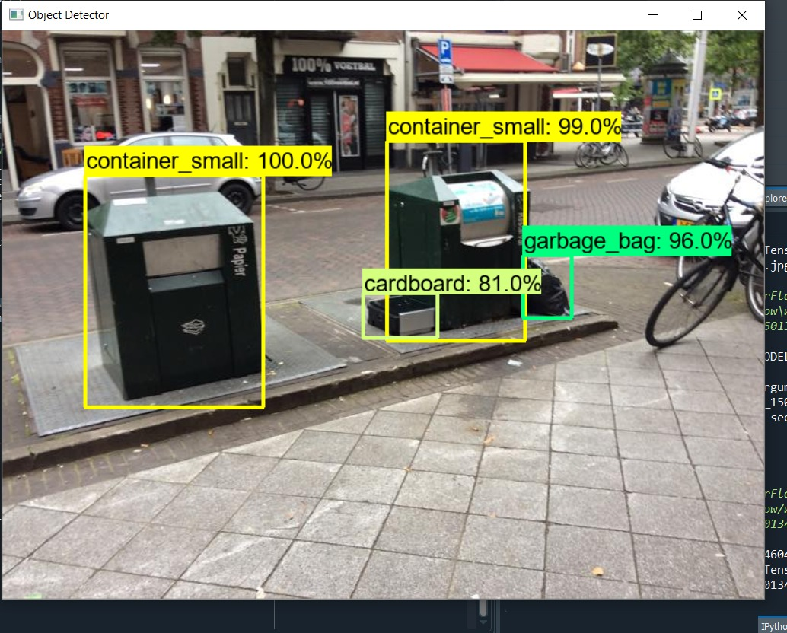

# Test Deployments
- Insurance cost using sklearn
- Car damage Image classification using deep learning keras framework
- Object detection Tensorflow 2 using ssd_mobilenet_v2_fpn_keras pretrained for Road litter detection
# Steps
- Clone repo and run app.py to deploy models on flask for deploying the three model via FLASK and API UI Flassger (can be accessed via port/apidocs/)
- Import dependencies check [https://tensorflow-object-detection-api-tutorial.readthedocs.io/en/latest/]( https://tensorflow-object-detection-api-tutorial.readthedocs.io/en/latest/)
- Find them running on [www.neurosymph.com](www.neurosymph.com)

  

